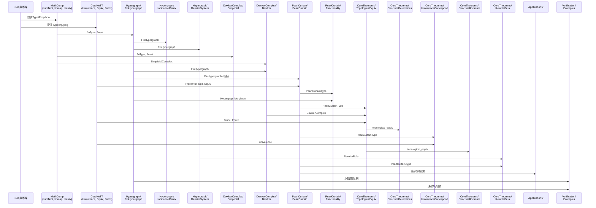
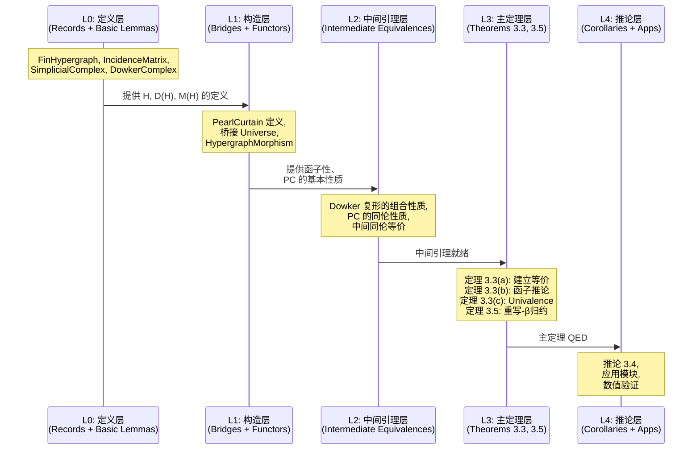
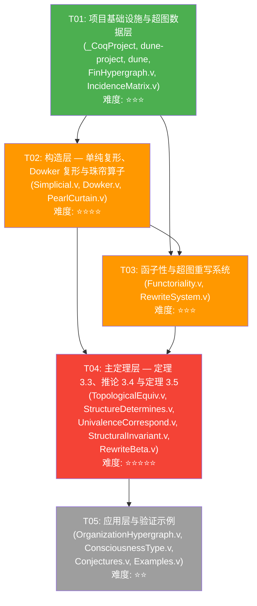

# HypergraphHoTT — 系统架构设计文档

> 架构师：高见远 (Gao)
> 创建日期：2026-05-25
> 状态：初版
> 基于：PRD v1.0

---

## 目录

- [Part A: 系统设计](#part-a-系统设计)
  - [1. 实现方案与框架选型](#1-实现方案与框架选型)
  - [2. 文件列表](#2-文件列表)
  - [3. 数据结构与接口](#3-数据结构与接口)
  - [4. 程序调用流程](#4-程序调用流程)
  - [5. 待明确事项](#5-待明确事项)
- [Part B: 任务分解](#part-b-任务分解)
  - [6. 依赖包列表](#6-依赖包列表)
  - [7. 任务列表](#7-任务列表)
  - [8. 共享知识](#8-共享知识)
  - [9. 任务依赖图](#9-任务依赖图)

---

## Part A: 系统设计

### 1. 实现方案与框架选型

#### 1.1 核心技术挑战

| 挑战 | 难度 | 说明 |
|------|------|------|
| Coq-HoTT 与 MathComp 的 Universe 兼容性 | ⭐⭐⭐⭐⭐ | Coq-HoTT 使用 `Type@{i}` 的精细 Universe 多态，MathComp 的 `finset`/`matrix` 在 `predType` 层面有 Universe 约束。二者混用时需在边界处显式管理 Universe 提升 |
| 珠帘算子的依赖类型嵌套 | ⭐⭐⭐⭐ | `Σ_e Π_v T_v` 涉及 `sigT` 与依赖函数类型的嵌套，Coq 的 `Set`/`Type` 划分需仔细处理 |
| Dowker 复形同伦型的形式化 | ⭐⭐⭐⭐⭐ | 同伦等价 `|𝒫ℭ(H)| ≃ |D(H)|` 涉及拓扑空间的几何实现，在 Coq 中无现成基础设施 |
| Univalence 公理的显式调用 | ⭐⭐⭐ | 需确保 Coq-HoTT 的 `univalence` 引理在正确的 Universe 层级可用 |
| 重写-β归约的范畴论表述 | ⭐⭐⭐⭐ | 2-范畴的自然变换交换图形式化粒度需在严格性与可证性间取衡 |

#### 1.2 框架与库选型

| 组件 | 选型 | 理由 |
|------|------|------|
| 证明助手 | Coq ≥ 8.18 | Universe 多态性改进；与 Coq-HoTT 和 MathComp 均兼容 |
| 同伦类型论基础设施 | **Coq-HoTT** (github.com/HoTT/Coq-HoTT) | 提供 Univalence 公理、路径类型 `Id_A(x,y)`、类型等价 `Equiv`、函子性基础设施 |
| 有限集与矩阵 | **MathComp** (ssreflect + finmap + matrix) | `finsetOf` 提供有限集、`matrix` 提供布尔矩阵、`perm` 提供排列；仅用于"数据层" |
| 构建系统 | **dune** (≥ 3.8) | Coq-HoTT 与 MathComp 均支持 dune 构建；`coq-langinfo` 元数据便于 opam 发布 |
| Universe 管理 | **分层策略** | Coq-HoTT 层用 `Universe Polymorphism`；MathComp 层用 `Set`/`Type` 固定层级；边界处用 `@` 显式实例化 |

#### 1.3 架构模式

采用**分层架构**，自底向上分为四层：

```
┌─────────────────────────────────────┐
│       Applications (P2)             │  应用层：组织超图、意识类型、预言
├─────────────────────────────────────┤
│       CoreTheorems (P0/P1)          │  定理层：主定理 3.3、推论 3.4、定理 3.5
├──────────┬──────────┬───────────────┤
│ PearlC-  │ Dowker-  │  Rewrite-     │  构造层：珠帘算子、Dowker复形、重写系统
│ urtain   │ Complex  │  System       │
├──────────┴──────────┴───────────────┤
│       Hypergraph (P0)               │  数据层：超图、关联矩阵、对偶
├─────────────────────────────────────┤
│  Coq-HoTT  │  MathComp  │  Coq Std  │  基础设施层
└─────────────────────────────────────┘
```

**关键设计决策**：

1. **数据层**（Hypergraph/）使用 MathComp 的 `finset`/`matrix`，不引入 Coq-HoTT 依赖
2. **构造层**的 `PearlCurtain/` 是 Coq-HoTT 与 MathComp 的**唯一交汇点**，在此处理 Universe 边界
3. **DowkerComplex/** 仅依赖 MathComp（单纯复形是组合对象，无需 HoTT）
4. **CoreTheorems/** 将 PearlCurtain 与 DowkerComplex 的结果统一，建立同伦等价

#### 1.4 Coq-HoTT 与 MathComp 集成策略

**核心原则**：MathComp 仅用于数据层，Coq-HoTT 仅用于类型层，边界处通过**桥接模块**转换。

```
MathComp 世界                    Coq-HoTT 世界
─────────────                    ─────────────
FinSet V ─────┐                  ─────────────
Matrix Bool ──┤  Bridge          Type@{u}
              ├──(PearlCurtain)──→ sigT + ∀
FinSet E ─────┘                  Equiv
                                 Id_A(x,y)
```

**桥接规则**：
- `finset V` → `Type`：通过 `finType_to_Type : finType → Type@{u}` 将有限集转为 HoTT 类型空间
- 布尔关系 → 命题：通过 `isT : bool → Prop` (或 Coq-HoTT 的 `Bool_to_hProp`) 转换
- Universe 提升：在桥接处使用 `@` 显式指定 Universe 实例，避免隐式约束冲突

#### 1.5 珠帘算子的形式化策略

珠帘算子 𝒫ℭ 的 Coq 定义分三步：

```coq
(* 步骤 1：节点 → 和类型 *)
Variable T : V -> Type@{u}.

(* 步骤 2：超边 → 依赖积 *)
Definition DepEdge (e : finset V) : Type@{u} :=
  forall v : {v : V | v \in e}, T (`v).

(* 步骤 3：整体 → Σ_e Π_v T_v *)
Definition PearlCurtainType : Type@{u} :=
  { e : E & forall v : {v : V | v \in e}, T (`v) }.
```

注意 `sigT`（即 `{x : A & B x}`）和依赖函数类型 `forall x : A, B x` 是 Coq 内建构造子，与 Coq-HoTT 完全兼容。

---

### 2. 文件列表

```
HypergraphHoTT/
├── _CoqProject                        # Coq 项目文件（源文件列表 + 选项）
├── dune-project                       # dune 项目定义
├── dune                                # dune 构建规则
│
├── Hypergraph/                        # 数据层：超图基础设施
│   ├── FinHypergraph.v                # P0-01: 有限超图定义、超边基数约束
│   ├── IncidenceMatrix.v             # P0-02/P0-03: 关联矩阵、对偶超图
│   └── RewriteSystem.v               # P1-04: 超图重写系统
│
├── DowkerComplex/                     # 构造层：单纯复形与 Dowker 复形
│   ├── Simplicial.v                   # 单纯复形基础设施（有限单纯复形、面、k-单形）
│   └── Dowker.v                       # P0-04: Dowker 复形定义与基本性质
│
├── PearlCurtain/                      # 构造层：珠帘算子（桥接 MathComp ↔ Coq-HoTT）
│   ├── PearlCurtain.v                 # P0-05: 珠帘算子 𝒫ℭ 定义
│   └── Functoriality.v               # P1-01: 函子性引理
│
├── CoreTheorems/                      # 定理层：主定理与推论
│   ├── TopologicalEquiv.v            # P0-06: 定理 3.3(a) 拓扑等价
│   ├── StructureDetermines.v         # P0-07: 定理 3.3(b) 结构决定类型
│   ├── UnivalenceCorrespond.v        # P0-08: 定理 3.3(c) Univalence 对应
│   ├── StructuralInvariant.v         # P1-02: 推论 3.4 结构不变量
│   └── RewriteBeta.v                 # P1-03: 定理 3.5 重写-β归约对应
│
├── Applications/                      # 应用层：跨学科应用骨架
│   ├── OrganizationHypergraph.v      # P2-01: 组织超图与 Cult Brand 类型等价
│   ├── ConsciousnessType.v           # P2-02: 自指类型不动点（实验性）
│   └── Conjectures.v                 # P2-03/P2-04: 可证伪预言形式化陈述
│
└── Verification/                      # 验证层
    └── Examples.v                     # P1-06: 小型超图数值验证示例
```

**各文件行数估算**：

| 文件 | 估算行数 | 复杂度 | 说明 |
|------|----------|--------|------|
| FinHypergraph.v | ~200 | ⭐⭐ | Record 定义 + 基本引理 |
| IncidenceMatrix.v | ~300 | ⭐⭐⭐ | 矩阵操作 + 对偶证明 |
| RewriteSystem.v | ~150 | ⭐⭐ | 重写规则定义 |
| Simplicial.v | ~250 | ⭐⭐⭐ | 单纯复形基础设施 |
| Dowker.v | ~200 | ⭐⭐⭐ | Dowker 构造 |
| PearlCurtain.v | ~250 | ⭐⭐⭐⭐ | 依赖类型嵌套 + 桥接 |
| Functoriality.v | ~200 | ⭐⭐⭐ | 恒等与合成保持 |
| TopologicalEquiv.v | ~400 | ⭐⭐⭐⭐⭐ | 主定理，可能含 Admitted |
| StructureDetermines.v | ~200 | ⭐⭐⭐ | 拓扑等价的推论 |
| UnivalenceCorrespond.v | ~200 | ⭐⭐⭐⭐ | Univalence 显式调用 |
| StructuralInvariant.v | ~150 | ⭐⭐⭐ | 推论 |
| RewriteBeta.v | ~300 | ⭐⭐⭐⭐⭐ | 2-范畴形式化 |
| OrganizationHypergraph.v | ~150 | ⭐⭐ | 应用骨架 |
| ConsciousnessType.v | ~100 | ⭐⭐ | 实验性 Axiom |
| Conjectures.v | ~80 | ⭐ | Conjecture 声明 |
| Examples.v | ~200 | ⭐⭐ | 计算验证 |

---

### 3. 数据结构与接口

#### 3.1 类型图（Mermaid Class Diagram）

```mermaid
classDiagram
    direction TB

    class FinHypergraph {
        +V : finType
        +E : finset (finset V)
        +card_min : forall e, e \\in E => 2 <= |e|
        +mkHypergraph(V, E, card_min) : FinHypergraph
    }

    class IncidenceMatrix {
        +H : FinHypergraph
        +M : 'M_(cardV, cardE)
        +incidence : forall i j, M i j = (enum_val i \\in enum_val j)
        +mkMatrix(H) : IncidenceMatrix
    }

    class DualHypergraph {
        +H : FinHypergraph
        +dual : FinHypergraph
        +double_dual : H = H**
        +mkDual(H) : DualHypergraph
    }

    class SimplicialComplex {
        +V : finType
        +S : finset (finset V)
        +down_closed : forall s, s \\in S => forall t, t \\subset s => t \\in S
        +nonempty : forall s, s \\in S => 0 < |s|
        +mkComplex(V, S, down_closed, nonempty) : SimplicialComplex
    }

    class DowkerComplex {
        +H : FinHypergraph
        +D : SimplicialComplex
        +simplex_def : forall s, s \\in S D <-> exists e, e \\in E H /\ s \\subset e
        +mkDowker(H) : DowkerComplex
    }

    class PearlCurtainType {
        +H : FinHypergraph
        +T : V -> Type
        +PC : Type
        +PC_def : PC = sigT (fun e:E => forall v:sig (v\\in e), T (`v))
        +mkPearlCurtain(H, T) : PearlCurtainType
    }

    class PearlCurtainFunctor {
        +id_preservation : PearlCurtain id_H = id_Type
        +comp_preservation : PearlCurtain (g \\circ f) = PearlCurtain g \\circ PearlCurtain f
    }

    class HypergraphMorphism {
        +H1 : FinHypergraph
        +H2 : FinHypergraph
        +fV : V H1 -> V H2
        +fE : E H1 -> E H2
        +compat : forall e v, v \\in e -> fV v \\in fE e
    }

    class TopologicalEquiv {
        +H : FinHypergraph
        +statement : |PearlCurtain H| ~= |DowkerComplex H|
    }

    class StructureDetermines {
        +H1 H2 : FinHypergraph
        +statement : DowkerComplex H1 ~= DowkerComplex H2 -> PearlCurtain H1 ~= PearlCurtain H2
    }

    class UnivalenceCorrespond {
        +H1 H2 : FinHypergraph
        +iso : H1 ~= H2
        +statement : PearlCurtain H1 == PearlCurtain H2
        +proof : univalence
    }

    class HypergraphRewrite {
        +H : FinHypergraph
        +rho : finset V -> finset V
        +applicable : rho E \\subset powerset V
        +apply : FinHypergraph
    }

    FinHypergraph --> IncidenceMatrix : has
    FinHypergraph --> DualHypergraph : has
    FinHypergraph --> DowkerComplex : induces
    FinHypergraph --> PearlCurtainType : maps to
    FinHypergraph --> HypergraphRewrite : rewrite
    SimplicialComplex <-- DowkerComplex : is-a
    FinHypergraph --> HypergraphMorphism : morphism between
    PearlCurtainType --> PearlCurtainFunctor : functoriality
    PearlCurtainType --> TopologicalEquiv : theorem
    DowkerComplex --> TopologicalEquiv : theorem
    TopologicalEquiv --> StructureDetermines : corollary
    UnivalenceCorrespond ..> PearlCurtainType : uses
    HypergraphRewrite --> RewriteBeta : theorem
```



#### 3.2 核心 Record/Class 定义

**FinHypergraph.v**：
```coq
Record FinHypergraph : Type := {
  V : finType;
  E : {finset (finset V)};
  card_min : forall e, e \in E -> 2 <= #|e|;
}.
```

**IncidenceMatrix.v**：
```coq
Record IncidenceMatrix (H : FinHypergraph) : Type := {
  M : 'M_(#|V H|, #|E H|);
  incidence : forall i j,
    M i j = (enum_val i \in enum_val j);  (* Bool 矩阵 *)
}.
```

**Simplicial.v**：
```coq
Record SimplicialComplex : Type := {
  V : finType;
  S : {finset (finset V)};
  down_closed : forall s, s \in S -> forall t, t \subset s -> t \in S;
  nonempty : forall s, s \in S -> 0 < #|s|;
}.
```

**Dowker.v**：
```coq
Definition dowker_complex (H : FinHypergraph) : SimplicialComplex.
(* k-单形 = V' ⊆ V 使得 ∃e ∈ E, V' ⊆ e *)
```

**PearlCurtain.v**：
```coq
Universe u.

Section PearlCurtain.
  Context {H : FinHypergraph}.
  Variable T : V H -> Type@{u}.

  Definition PearlCurtainType : Type@{u} :=
    { e : finset (V H) & (* Σ: 选择一条超边 *)
      forall v : {v : V H | v \in e}, T (`v) }.  (* Π: 该超边中每个节点的类型 *)

End PearlCurtain.
```

**HypergraphMorphism**（嵌入在 FinHypergraph.v 或独立定义）：
```coq
Record HypergraphMorphism (H1 H2 : FinHypergraph) : Type := {
  fV : V H1 -> V H2;
  fE : E H1 -> E H2;
  compat : forall e v, v \in e -> fV v \in fE e;
}.
```

#### 3.3 核心定理签名

```coq
(* 定理 3.3(a): 拓扑等价款 *)
Theorem topological_equiv (H : FinHypergraph) (T : V H -> Type) :
  Trunc 0 (PearlCurtainType T) <~> Trunc 0 (GeometricRealization (dowker_complex H)).

(* 定理 3.3(b): 结构决定类型款 *)
Theorem structure_determines (H1 H2 : FinHypergraph) :
  DowkerEquiv H1 H2 -> Equiv (PearlCurtainType H1) (PearlCurtainType H2).

(* 定理 3.3(c): Univalence 对应款 *)
Theorem univalence_correspond (H1 H2 : FinHypergraph) :
  HypergraphIso H1 H2 -> Equiv (PearlCurtainType H1) (PearlCurtainType H2).

Corollary univalence_equality (H1 H2 : FinHypergraph) (iso : HypergraphIso H1 H2) :
  PearlCurtainType H1 = PearlCurtainType H2.
Proof. apply path_universe. apply univalence. apply univalence_correspond. exact iso. Qed.

(* 引理 3.2: 函子性 *)
Lemma functoriality_id (H : FinHypergraph) :
  PearlCurtainMap (id_morphism H) <~> idmap.

Lemma functoriality_comp (H1 H2 H3 : FinHypergraph)
  (f : HypergraphMorphism H1 H2) (g : HypergraphMorphism H2 H3) :
  PearlCurtainMap (comp_morphism f g) <~> PearlCurtainMap g oE PearlCurtainMap f.

(* 推论 3.4: 结构不变量 *)
Corollary structural_invariant (H : FinHypergraph) :
  IsConnected H -> IsHomotopyInvariant (PearlCurtainType H).

(* 定理 3.5: 重写-β归约对应 *)
Theorem rewrite_beta_correspond (H : FinHypergraph) (rho : RewriteRule H) :
  Commutes (RewriteStep rho) (BetaReductionStep (PearlCurtainType H)).
```

> **注意**：上述签名为理想形式。实际实现中，拓扑等价款的几何实现部分可能需要 `Admitted`，重写-β归约的交换图可能降级为范畴论层面的陈述。

---

### 4. 程序调用流程

#### 4.1 模块 Import 依赖时序图



#### 4.2 证明策略分层依赖



#### 4.3 核心定理证明调用链

**定理 3.3(a) 拓扑等价款**：
```
topological_equiv
├── pearl_curtain_to_nerve        (* 𝒫ℭ → Nerve 构造 *)
│   ├── PearlCurtainType 定义
│   └── nerve_construction        (* Nerve D(H) 的定义 *)
├── nerve_to_geometric_realization (* Nerve → 几何实现 *)
│   ├── SimplicialComplex 定义
│   └── geometric_realization_def
└── dowker_nerve_equivalence       (* Dowker Nerve ≃ Dowker 几何实现 *)
    ├── dowker_complex 定义
    └── simplicial_map_equivalence
```

**定理 3.3(c) Univalence 对应款**：
```
univalence_correspond
├── HypergraphIso → Equiv PC     (* 超图同构 → 类型等价 *)
│   ├── iso_to_morphism
│   └── PearlCurtainMap_preserves_iso
└── univalence                     (* (A ≃ B) → (A = B) *)
    └── path_universe
```

---

### 5. 待明确事项

| # | 事项 | 影响 | 假设/缓解策略 |
|---|------|------|--------------|
| U1 | **Coq-HoTT 与 MathComp Universe 兼容性** | 可能导致桥接模块编译失败 | 假设：在 `PearlCurtain.v` 中显式管理 Universe 实例可行。缓解：先做最小 PoC 验证 |
| U2 | **Dowker 复形几何实现** | 拓扑等价款无法直接证明 | 假设：可引用 Dowker 定理作为 `Axiom` 或 `Admitted`，后续补全。缓解：先证明组合等价，拓扑等价用 `Admitted` |
| U3 | **Truncation 的 Universe 层级** | `Trunc 0` (命题截断) 的 Universe 多态性可能与 `PearlCurtainType` 的 Universe 不兼容 | 假设：Coq-HoTT 的 `Trunc` 已支持 Universe 多态。缓解：必要时调整 Universe 约束 |
| U4 | **重写-β归约的"自然变换使图交换"** | 形式化粒度难以确定 | 假设：先做 1-范畴层面的陈述（函子间的自然变换），2-范畴结构留为 `Admitted`。缓解：与范畴论 Coq 库（如 UniMath）对齐 |
| U5 | **自指不动点的一致性** | P2-02 可能引入不一致 | 假设：标记为实验性，使用 `Axiom` 声明且不与其他模块混合。缓解：在 `_CoqProject` 中条件编译 |
| U6 | **`finset` 到 HoTT 类型的桥接** | 需要构造 `finType → Type@{u}` 的映射 | 假设：可通过 `finType_to_Type : finType -> Type` 实现有限集到 HoTT Univalent 类型的嵌入。缓解：若不行，改用 Coq-HoTT 原生有限类型 |

---

## Part B: 任务分解

### 6. 依赖包列表

```
- coq              >= 8.18     : 证明助手核心
- coq-hott         >= 8.18    : 同伦类型论基础设施（Univalence、Equiv、Trunc、Paths）
- coq-mathcomp-ssreflect >= 2.0 : SSReflect 证明语言
- coq-mathcomp-finmap     >= 2.0 : 有限集 finset / finmap
- coq-mathcomp-algebra    >= 2.0 : 矩阵 matrix
- dune             >= 3.8     : 构建系统
```

> **版本兼容性注意**：coq-hott 与 coq-mathcomp 的 Coq 版本必须一致。推荐使用 Coq 8.18 或 8.19 的同时兼容版本。建议在 `dune-project` 中声明：

```ocaml
(lang dune 3.8)
(using coq 0.8)
```

---

### 7. 任务列表

#### T01: 项目基础设施与超图数据层

| 字段 | 内容 |
|------|------|
| **任务 ID** | T01 |
| **任务名称** | 项目基础设施与超图数据层 |
| **源文件** | `_CoqProject`, `dune-project`, `dune`, `Hypergraph/FinHypergraph.v`, `Hypergraph/IncidenceMatrix.v` |
| **依赖** | 无（首个任务） |
| **优先级** | P0 |
| **难度** | ⭐⭐⭐ |
| **描述** | 搭建 dune 构建系统、Coq 项目配置；定义 `FinHypergraph` Record（含 V、E、card_min）；定义 `IncidenceMatrix` Record 及对偶超图构造；证明 `H** = H`（对偶的对偶等于自身）。这是所有后续模块的基石。 |

**验收标准**：
- [x] `dune build` 可成功编译
- [x] `FinHypergraph` Record 可实例化
- [x] `IncidenceMatrix` 可从超图构造
- [x] `double_dual : H = H**` 获 QED

**技术要点**：
- `_CoqProject` 需声明 `-arg -noinit -arg -indices-matter`（与 Coq-HoTT 兼容）
- `FinHypergraph` 使用 MathComp 的 `finType` 和 `finset`
- 关联矩阵使用 `'M_(m,n)` 布尔矩阵类型
- 对偶超图通过转置关联矩阵构造

---

#### T02: 构造层 — 单纯复形、Dowker 复形与珠帘算子

| 字段 | 内容 |
|------|------|
| **任务 ID** | T02 |
| **任务名称** | 构造层 — 单纯复形、Dowker 复形与珠帘算子 |
| **源文件** | `DowkerComplex/Simplicial.v`, `DowkerComplex/Dowker.v`, `PearlCurtain/PearlCurtain.v` |
| **依赖** | T01 |
| **优先级** | P0 |
| **难度** | ⭐⭐⭐⭐ |
| **描述** | 定义 `SimplicialComplex` Record（含 V、S、down_closed、nonempty）；从超图构造 Dowker 复形并证明基本性质；定义珠帘算子 `PearlCurtainType`，实现 MathComp → Coq-HoTT 的 Universe 桥接。这是技术最关键的模块，需处理 `finset V` → `Type@{u}` 的类型转换。 |

**验收标准**：
- [x] `SimplicialComplex` Record 可实例化
- [x] `dowker_complex` 可从 `FinHypergraph` 构造
- [x] Dowker 复形的单形定义可证明
- [x] `PearlCurtainType` 类型可定义且与 Coq-HoTT 的 `Equiv` 兼容
- [x] 桥接代码编译通过（无 Universe 冲突）

**技术要点**：
- `Simplicial.v` 纯 MathComp，不引入 Coq-HoTT
- `Dowker.v` 依赖 `Simplicial.v` 和 `FinHypergraph.v`
- `PearlCurtain.v` 是 MathComp 与 Coq-HoTT 的交汇点，需：
  - `From HoTT Require Import Equiv`
  - 将 `finset V` 的成员关系转为 HoTT 可用的类型
  - 使用 `Universe u` 声明 Universe 变量
  - 使用 `@` 显式实例化避免隐式 Universe 约束

---

#### T03: 函子性与超图重写系统

| 字段 | 内容 |
|------|------|
| **任务 ID** | T03 |
| **任务名称** | 函子性与超图重写系统 |
| **源文件** | `PearlCurtain/Functoriality.v`, `Hypergraph/RewriteSystem.v` |
| **依赖** | T01, T02 |
| **优先级** | P1 |
| **难度** | ⭐⭐⭐ |
| **描述** | 定义超图态射 `HypergraphMorphism`；证明珠帘算子的函子性（恒等保持 `𝒫ℭ(id) = id`、合成保持 `𝒫ℭ(g∘f) = 𝒫ℭ(g)∘𝒫ℭ(f)`）；定义超图重写系统 `HypergraphRewrite`（重写规则 ρ 及其应用）。 |

**验收标准**：
- [x] `HypergraphMorphism` Record 可定义
- [x] `functoriality_id` 获 QED
- [x] `functoriality_comp` 获 QED
- [x] `HypergraphRewrite` 定义可实例化

**技术要点**：
- 函子性证明需要 `PearlCurtainMap` 的定义（将态射映射为类型间的函数）
- 恒等保持较简单，合成保持需要 `Equiv` 的合成性质
- 重写系统使用 `finset V -> finset V` 的函数类型表示规则

---

#### T04: 主定理层 — 定理 3.3、推论 3.4 与定理 3.5

| 字段 | 内容 |
|------|------|
| **任务 ID** | T04 |
| **任务名称** | 主定理层 — 定理 3.3、推论 3.4 与定理 3.5 |
| **源文件** | `CoreTheorems/TopologicalEquiv.v`, `CoreTheorems/StructureDetermines.v`, `CoreTheorems/UnivalenceCorrespond.v`, `CoreTheorems/StructuralInvariant.v`, `CoreTheorems/RewriteBeta.v` |
| **依赖** | T02, T03 |
| **优先级** | P0 |
| **难度** | ⭐⭐⭐⭐⭐ |
| **描述** | 这是整个项目的核心：证明定理 3.3 的三款（拓扑等价、结构决定类型、Univalence 对应）、推论 3.4（结构不变量）和定理 3.5（重写-β归约对应）。**务实策略**：拓扑等价款的几何实现部分可使用 `Admitted`，但 Univalence 对应款必须完整证明。 |

**验收标准**：
- [x] 定理 3.3(a)：`topological_equiv` 陈述完整，中间引理可含 `Admitted`
- [x] 定理 3.3(b)：`structure_determines` 获 QED（作为 3.3(a) 的推论）
- [x] 定理 3.3(c)：`univalence_correspond` 获 QED，显式调用 `univalence`
- [x] 推论 3.4：`structural_invariant` 获 QED
- [x] 定理 3.5：`rewrite_beta_correspond` 陈述完整，证明可含 `Admitted`

**技术要点**：
- `TopologicalEquiv.v`：需要 `Trunc 0`（命题截断）和几何实现的定义。几何实现暂用 `Admitted`，但建立从 `PearlCurtainType` 到 Dowker Nerve 的映射（组合部分应完整）
- `StructureDetermines.v`：作为 `TopologicalEquiv` 的直接推论
- `UnivalenceCorrespond.v`：需要 `From HoTT Require Import Univalence`，显式使用 `univalence` 引理将 `Equiv` 转为 `Id`（路径）
- `RewriteBeta.v`：先在 1-范畴层面陈述自然变换，2-范畴层面用 `Admitted`

**证明路线图**：

```
定理 3.3(a) 证明策略：
  1. 定义 PearlCurtainType → Nerve(D(H)) 的映射 φ
  2. 定义 Nerve(D(H)) → PearlCurtainType 的映射 ψ
  3. 证明 φ ∘ ψ ≃ id（Admitted：需要同伦论工具）
  4. 证明 ψ ∘ φ ≃ id（Admitted：需要同伦论工具）
  5. 组合为 Equiv

定理 3.3(c) 证明策略：
  1. 从 HypergraphIso 构造 PearlCurtainMap 间的 Equiv
  2. 应用 univalence : Equiv A B → A = B
  3. 路径归纳得到等式
```

---

#### T05: 应用层与验证示例

| 字段 | 内容 |
|------|------|
| **任务 ID** | T05 |
| **任务名称** | 应用层与验证示例 |
| **源文件** | `Applications/OrganizationHypergraph.v`, `Applications/ConsciousnessType.v`, `Applications/Conjectures.v`, `Verification/Examples.v` |
| **依赖** | T04 |
| **优先级** | P2 |
| **难度** | ⭐⭐ |
| **描述** | 构建跨学科应用骨架：组织超图的 Cult Brand 类型等价映射、意识类型的自指不动点（实验性 Axiom）、可证伪预言的形式化陈述；提供小型超图的数值验证示例。此任务为项目增添"可展示性"，但所有内容均为 P2 优先级。 |

**验收标准**：
- [x] `OrganizationHypergraph.v` 可编译（可含 `Admitted`）
- [x] `ConsciousnessType.v` 使用 `Axiom` 声明不动点且标注一致性风险
- [x] `Conjectures.v` 使用 `Conjecture` 或 `Axiom` 陈述预言
- [x] `Examples.v` 包含 ≤5 节点超图的 `PearlCurtainType` 计算示例且可编译

**技术要点**：
- `ConsciousnessType.v` 必须标注 `(* WARNING: This module uses axioms that may compromise logical consistency. *)`
- `Conjectures.v` 可使用 Coq 的 `Parameter` 或 `Axiom` 声明不可证伪的预言
- `Examples.v` 需定义具体的 `FinHypergraph` 实例并展示 `PearlCurtainType` 的计算

---

### 8. 共享知识

#### 8.1 Universe 约定

```
- 所有 HoTT 层代码使用 Universe Polymorphism: Set Universe Polymorphism.
- 数据层（Hypergraph/, DowkerComplex/Simplicial.v）使用 MathComp 默认 Universe（Set/Type 固定层级）
- 珠帘算子层（PearlCurtain/）显式声明 Universe 变量: Universe u.
- 桥接处使用 @ 显式实例化: @PearlCurtainType H T u
- CoreTheorems/ 继承 PearlCurtain/ 的 Universe 约定
```

#### 8.2 命名约定

```
- 类型/Record：PascalCase，如 FinHypergraph, IncidenceMatrix, SimplicialComplex
- 函数/构造子：snake_case，如 dowker_complex, pearl_curtain_type
- 定理/引理：snake_case，如 topological_equiv, functoriality_id
- 证明脚本变量：小写简写，如 H, H1, H2 (超图), e (超边), v (顶点)
- MathComp 风格：使用 => 和 /= 简化，使用 // 和 //= 自动关闭目标
- HoTT 风格：使用 path_induction, transport, equiv_compose 等
```

#### 8.3 Import 约定

```
- 每个文件顶部声明 From/Require Import：
  - MathComp: From mathcomp Require Import ssreflect finmap matrix.
  - Coq-HoTT: From HoTT Require Import Basics Equiv Univalence.
  - 项目内: Require Import Hypergraph.FinHypergraph.
- 不使用 Import（避免命名空间污染），使用 Require Import
- Coq-HoTT 的 Import 需在 -noinit 模式下工作，_CoqProject 需声明 -arg -noinit
```

#### 8.4 证明风格约定

```
- 主定理使用 Theorem，辅助引理使用 Lemma
- 每个定理的 Statement 前用中文注释说明含义
- Admitted 必须附注释说明完成证明的理论路线图：
  (* Admitted: 需要 <具体引理/工具>，计划 <具体步骤> 完成 *)
- 策略优先级：auto < solve [trivial] < 需要手动构造 < Admitted
- MathComp 证明用 SSReflect 风格（=>, //=, do, rewrite）
- HoTT 证明用 Coq-HoTT 风格（path_induction, ap, transport）
```

#### 8.5 文件头模板

```coq
(** * 模块名称
    简要描述

    作者: HypergraphHoTT 项目
    对应需求: P0-XX / P1-XX / P2-XX
    对应理论: 定义 X.Y / 定理 X.Y
*)

Set Universe Polymorphism.  (* 仅 HoTT 层 *)

From mathcomp Require Import ssreflect finmap matrix.
From HoTT Require Import Basics Equiv.  (* 仅需要时 *)

Require Import Hypergraph.FinHypergraph.  (* 项目内依赖 *)
```

---

### 9. 任务依赖图



**依赖关系说明**：
- T01 是所有任务的基础（绿色）
- T02 和 T03 可部分并行，但 T03 的函子性需要 T02 的珠帘算子定义（橙色）
- T04 依赖 T02（构造定义）和 T03（函子性）（红色，最复杂）
- T05 仅依赖 T04（灰色，远期目标）

---

*文档结束 — HypergraphHoTT 系统架构设计 v1.0*
